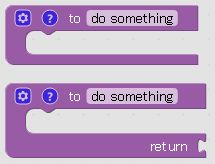
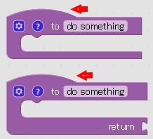

```javascript
/**
 * Do blocks with no previous or output connections have a 'hat' on top?
 * @const
 */
Blockly.BlockSvg.START_HAT = false;
/**
 * Height of the top hat.
 * @const
 */
Blockly.BlockSvg.START_HAT_HEIGHT = 15;
```



```javascript
/**
 * Do blocks with no previous or output connections have a 'hat' on top?
 * @const
 */
Blockly.BlockSvg.START_HAT = true;
/**
 * Height of the top hat.
 * @const
 */
Blockly.BlockSvg.START_HAT_HEIGHT = 15;
```

