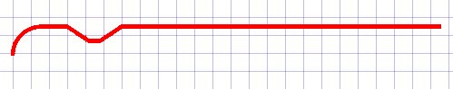
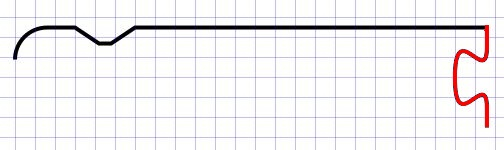
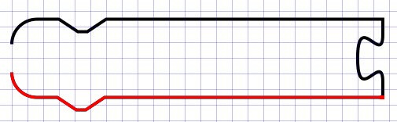
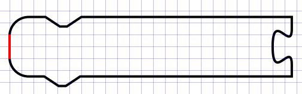

# Blockly.BlockSvg.SEP_SPACE_X
```javascript
/**
 * Horizontal space between elements.
 * @const
 */
Blockly.BlockSvg.SEP_SPACE_X = 10;
```

```javascript
/**
 * Horizontal space between elements.
 * @const
 */
Blockly.BlockSvg.SEP_SPACE_X = 30;
```


# Blockly.BlockSvg.START_HAT
```javascript
/**
 * Do blocks with no previous or output connections have a 'hat' on top?
 * @const
 */
Blockly.BlockSvg.START_HAT = false;
/**
 * Height of the top hat.
 * @const
 */
Blockly.BlockSvg.START_HAT_HEIGHT = 15;
```


```javascript
/**
 * Do blocks with no previous or output connections have a 'hat' on top?
 * @const
 */
Blockly.BlockSvg.START_HAT = true;
/**
 * Height of the top hat.
 * @const
 */
Blockly.BlockSvg.START_HAT_HEIGHT = 15;
```

# Blockly.BlockSvg.TAB_WIDTH
```javascript
/**
 * Width of horizontal puzzle tab.
 * @const
 */
Blockly.BlockSvg.TAB_WIDTH = 8;
```

```javascript
/**
 * Width of horizontal puzzle tab.
 * @const
 */
Blockly.BlockSvg.TAB_WIDTH = 30;
```


# Blockly.BlockSvg.prototype.renderDraw_

```javascript
/**
 * Draw the path of the block.
 * Move the fields to the correct locations.
 * @param {number} iconWidth Offset of first row due to icons.
 * @param {!Array.<!Array.<!Object>>} inputRows 2D array of objects, each
 *     containing position information.
 * @private
 */
Blockly.BlockSvg.prototype.renderDraw_ = function(iconWidth, inputRows) {
  /*****/
  // Assemble the block's path.
  var steps = [];
  /*****/
  this.renderDrawTop_(steps, highlightSteps, inputRows.rightEdge);
  var cursorY = this.renderDrawRight_(steps, highlightSteps, inlineSteps,
  highlightInlineSteps, inputRows, iconWidth);
  this.renderDrawBottom_(steps, highlightSteps, cursorY);
  this.renderDrawLeft_(steps, highlightSteps);
  /*****/
};
```


## renderDrawTop_
```html
<html>
<body>
<svg height="210" width="400">
  <path style="fill:none;fill-rule:evenodd;stroke:#000000;stroke-width:1px;stroke-linecap:butt;stroke-linejoin:miter;stroke-opacity:1"
  d="m 0,8 A 8,8 0 0,1 8,0 H 15 l 6,4 3,0 6,-4 H 117.97848510742188" />
</svg>
</body>
</html>
```


## renderDrawRight_
```html
<html>
<body>
<svg height="210" width="400">
  <path style="fill:none;fill-rule:evenodd;stroke:#000000;stroke-width:1px;stroke-linecap:butt;stroke-linejoin:miter;stroke-opacity:1"
  d="m 0,8 A 8,8 0 0,1 8,0 H 15 l 6,4 3,0 6,-4 H 117.97848510742188 v 5 c 0,10 -8,-8 -8,7.5 s 8,-2.5 8,7.5 v 5" />
</svg>
</body>
</html>
```



## renderDrawBottom_
```html
<html>
<body>
<svg height="210" width="400">
  <path style="fill:none;fill-rule:evenodd;stroke:#000000;stroke-width:1px;stroke-linecap:butt;stroke-linejoin:miter;stroke-opacity:1"
  d="m 0,8 A 8,8 0 0,1 8,0 H 15 l 6,4 3,0 6,-4 H 117.97848510742188 v 5 c 0,10 -8,-8 -8,7.5 s 8,-2.5 8,7.5 v 5 H 29.5 l -6,4 -3,0 -6,-4 H 8 a 8,8 0 0,1 -8,-8" />
</svg>
</body>
</html>
```


## renderDrawLeft_
```html
<html>
<body>
<svg height="210" width="400">
  <path style="fill:none;fill-rule:evenodd;stroke:#000000;stroke-width:1px;stroke-linecap:butt;stroke-linejoin:miter;stroke-opacity:1"
  d="m 0,8 A 8,8 0 0,1 8,0 H 15 l 6,4 3,0 6,-4 H 117.97848510742188 v 5 c 0,10 -8,-8 -8,7.5 s 8,-2.5 8,7.5 v 5 H 29.5 l -6,4 -3,0 -6,-4 H 8 a 8,8 0 0,1 -8,-8 z" />
</svg>
</body>
</html>
```

