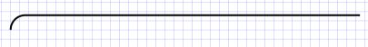

# Blockly.BlockSvg.SEP_SPACE_X
```javascript
/**
 * Horizontal space between elements.
 * @const
 */
Blockly.BlockSvg.SEP_SPACE_X = 10;
```

```javascript
/**
 * Horizontal space between elements.
 * @const
 */
Blockly.BlockSvg.SEP_SPACE_X = 30;
```


# Blockly.BlockSvg.START_HAT
```javascript
/**
 * Do blocks with no previous or output connections have a 'hat' on top?
 * @const
 */
Blockly.BlockSvg.START_HAT = false;
/**
 * Height of the top hat.
 * @const
 */
Blockly.BlockSvg.START_HAT_HEIGHT = 15;
```


```javascript
/**
 * Do blocks with no previous or output connections have a 'hat' on top?
 * @const
 */
Blockly.BlockSvg.START_HAT = true;
/**
 * Height of the top hat.
 * @const
 */
Blockly.BlockSvg.START_HAT_HEIGHT = 15;
```

# Blockly.BlockSvg.TAB_WIDTH
```javascript
/**
 * Width of horizontal puzzle tab.
 * @const
 */
Blockly.BlockSvg.TAB_WIDTH = 8;
```

```javascript
/**
 * Width of horizontal puzzle tab.
 * @const
 */
Blockly.BlockSvg.TAB_WIDTH = 30;
```


# Blockly.BlockSvg.prototype.renderDrawTop_
```javascript
/**
 * Render the top edge of the block.
 * @param {!Array.<string>} steps Path of block outline.
 * @param {!Array.<string>} highlightSteps Path of block highlights.
 * @param {number} rightEdge Minimum width of block.
 * @private
 */
Blockly.BlockSvg.prototype.renderDrawTop_ =
    function(steps, highlightSteps, rightEdge) {
  /* eslint-disable indent */
  // Position the cursor at the top-left starting point.
  if (this.squareTopLeftCorner_) {
    steps.push('m 0,0');
    highlightSteps.push('m 0.5,0.5');
    if (this.startHat_) {
      steps.push(Blockly.BlockSvg.START_HAT_PATH);
      highlightSteps.push(this.RTL ?
          Blockly.BlockSvg.START_HAT_HIGHLIGHT_RTL :
          Blockly.BlockSvg.START_HAT_HIGHLIGHT_LTR);
    }
  } else {
    steps.push(Blockly.BlockSvg.TOP_LEFT_CORNER_START); /* CHECK!! */
    highlightSteps.push(this.RTL ?
        Blockly.BlockSvg.TOP_LEFT_CORNER_START_HIGHLIGHT_RTL :
        Blockly.BlockSvg.TOP_LEFT_CORNER_START_HIGHLIGHT_LTR);
    // Top-left rounded corner.
    steps.push(Blockly.BlockSvg.TOP_LEFT_CORNER); /* CHECK!! */
    highlightSteps.push(Blockly.BlockSvg.TOP_LEFT_CORNER_HIGHLIGHT);
  }

  // Top edge.
  if (this.previousConnection) {
    steps.push('H', Blockly.BlockSvg.NOTCH_WIDTH - 15);
    highlightSteps.push('H', Blockly.BlockSvg.NOTCH_WIDTH - 15);
    steps.push(Blockly.BlockSvg.NOTCH_PATH_LEFT);
    highlightSteps.push(Blockly.BlockSvg.NOTCH_PATH_LEFT_HIGHLIGHT);

    var connectionX = (this.RTL ?
        -Blockly.BlockSvg.NOTCH_WIDTH : Blockly.BlockSvg.NOTCH_WIDTH);
    this.previousConnection.setOffsetInBlock(connectionX, 0);
  }
  steps.push('H', rightEdge); /* CHECK!! */
  highlightSteps.push('H', rightEdge - 0.5);
  this.width = rightEdge;
};  /* eslint-enable indent */
```
```html
<html>
<body>
<svg height="210" width="400">
  <path style="fill:none;stroke:#FF0000;stroke-width:1px"
   d="m 0,8 A 8,8 0 0,1 8,0 H 192.21038818359375"/>
</svg>
</body>
</html>
```

