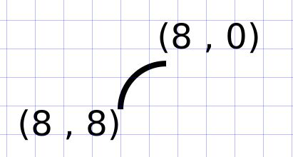

# Elliptical curves

```html
<html>
<body>
<svg height="210" width="400">
  <path style="fill:none;fill-rule:evenodd;stroke:#000000;stroke-width:1px;stroke-linecap:butt;stroke-linejoin:miter;stroke-opacity:1"
  d="m 0,8 A 8,8 0 0,1 8,0" />
</svg>
</body>
</html>
```

d="m 0,8 A **8,8** 0 0,1 **8,0**"


